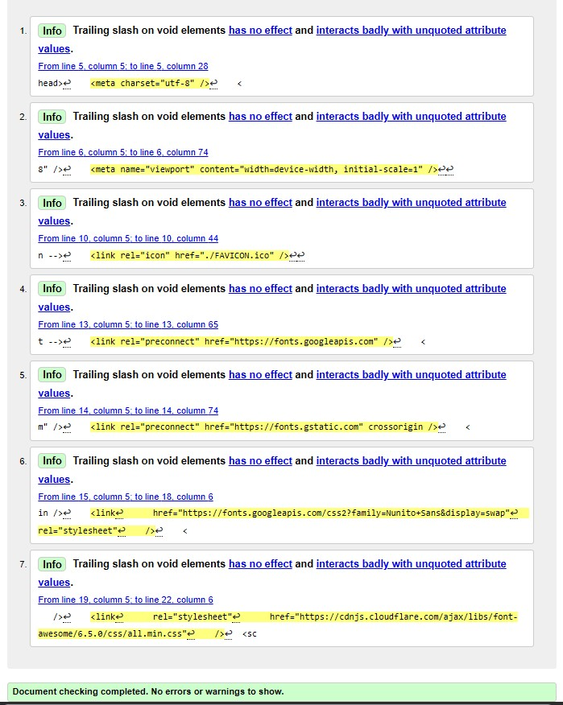
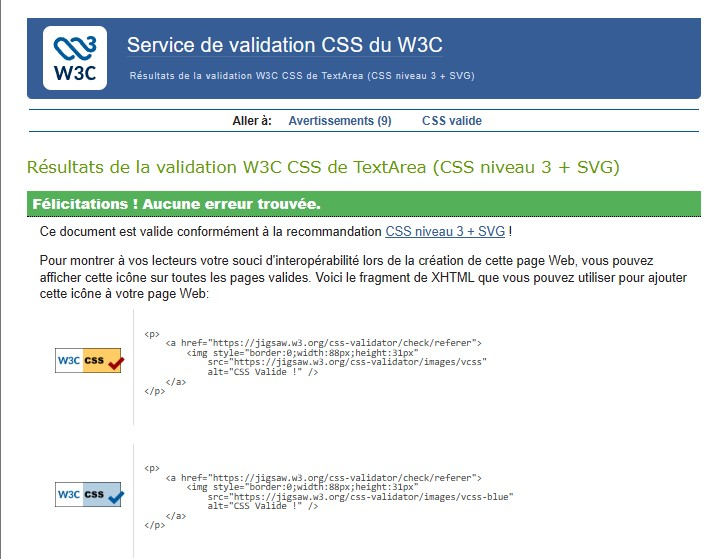

# Mon CV React

Projet réalisé dans le cadre de la formation Développeur Web du CEF.

Ce projet consiste à créer un CV en ligne responsive avec React.js, Bootstrap et React Router.

---

# Liens du projet

## Repository GitHub

https://github.com/SARA370/mon-cv-react

## Site hébergé

https://react-cv-john-doe.netlify.app

---

# Technologies utilisées

- React.js
- React Router
- Bootstrap 5
- Font Awesome
- HTML5
- CSS3
- JavaScript ES6

---

# Fonctionnalités

Le site contient :

- Une page d’accueil
- Une page services
- Une page portfolio
- Une page blog
- Une page contact
- Une page mentions légales
- Un footer responsive
- Un menu hamburger responsive
- Une intégration API GitHub

---

# Installation du projet

## Cloner le repository

```bash
git clone https://github.com/SARA370/mon-cv-react.git
Accéder au dossier
cd mon-cv-react
Installer les dépendances
npm install
Lancer le projet
npm start

Le projet sera accessible sur :

http://localhost:3000
Build de production
npm run build
Hébergement

Le site est hébergé sur Netlify.

Le déploiement se fait automatiquement via GitHub après chaque push sur la branche main.

SEO et accessibilité

Le projet respecte plusieurs bonnes pratiques :

utilisation des balises sémantiques
hiérarchie des titres
liens accessibles
aria-label sur les boutons nécessaires
responsive mobile
optimisation de la navigation
images avec attribut alt
Validation W3C

Le code HTML et CSS a été validé avec les validateurs W3C.
# Validation W3C

## HTML

La page HTML a été validée avec le validateur W3C.



## CSS

Le fichier CSS a été validé avec le validateur W3C.

